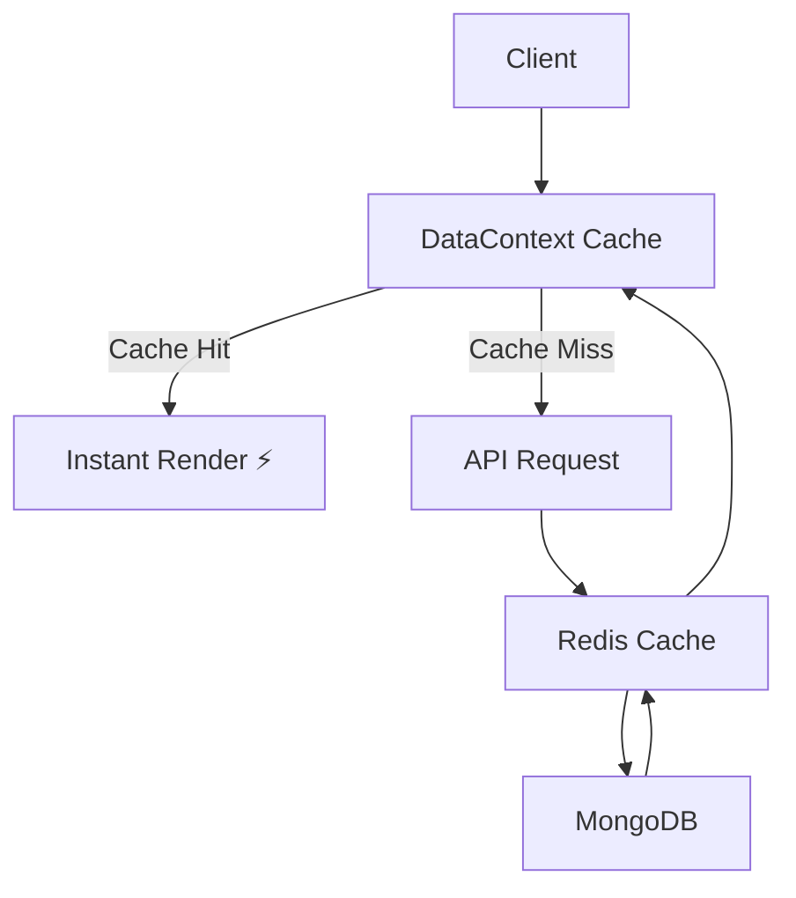

# 🚀 Starkk.shop — Next-Gen MERN E-Commerce Platform

<p align="center">
  
</p>

<p align="center">
  <b>⚡ Blazing Fast • 🧠 Smart Search • 🛒 Full-Stack Commerce • 🎯 Production Ready</b>
</p>

<p align="center">
  <a href="https://starkk.shop"></a>
  
  
  
</p>

---

## 🌐 Live Demo

👉 **https://starkk.shop**

---

## 🧠 Overview

**Starkk.shop** is a **high-performance, scalable MERN e-commerce platform** engineered with a focus on **speed, intelligent data flow, and seamless user experience**.

Unlike traditional e-commerce apps, Starkk is built with:

* ⚡ **Ultra-fast loading (cache-first architecture)**
* 🔍 **Smart search (Elasticsearch + MongoDB fallback)**
* 🧩 **Dynamic layout system (data-driven UI)**
* 📦 **Centralized state + caching (Redux + Context API)**

💡 This is not just a project — it's a **production-grade system design**.

---

## ✨ Key Features

### 🛍️ Core E-Commerce

* Dynamic product listings with layout engine
* Category-based filtering & smart browsing
* Cart & wishlist with persistent state
* Secure JWT-based authentication

### 🔍 Smart Search System

* Elasticsearch-powered search
* Trending & recent searches
* Intelligent suggestions (products, sellers, categories)

### ⚡ Performance First Architecture

* Centralized caching via `DataContext`
* Redux Toolkit global state management
* Stale-checking (prevents redundant API calls)
* Lazy loading + code splitting

### 🧑‍💼 Seller System

* OTP + password-based authentication
* Seller dashboard-ready backend
* Product management system

### 🧠 Intelligent Backend

* Optimized `/initial-data` endpoint
* Redis caching + background cache warming
* MongoDB indexing for high-speed queries
* Image sanitization + fallback system

---

## 🏗️ Tech Stack

### 🖥️ Frontend

* React.js
* Redux Toolkit
* Context API
* Tailwind CSS
* Framer Motion

### ⚙️ Backend

* Node.js
* Express.js
* MongoDB (Mongoose)
* Redis (Caching Layer)
* Elasticsearch (Search Engine)

### 🔐 Tools & Services

* JWT Authentication
* Axios
* Cloudinary

---

## 📂 Project Structure

```bash
stark/
├── frontend/
│   ├── components/
│   ├── pages/
│   ├── context/
│   ├── redux/
│   └── utils/
│
├── backend/
│   ├── routes/
│   ├── models/
│   ├── middleware/
│   └── services/
│
└── README.md
```

---

## ⚡ Performance Philosophy

> ⚡ “Speed is a feature.”

* 🚫 No unnecessary API calls
* 🧠 Smart cache invalidation
* ⚡ Instant navigation (no reload feel)
* 📦 Preloaded critical data (`/initial-data`)

---

## 🔄 Data Flow Architecture



---

## 📸 Screenshots

> Add your UI screenshots here for maximum impact 🚀

---

## 🚀 Getting Started

### 1️⃣ Clone the Repository

```bash
git clone https://github.com/sharadhkr/stark.git
cd stark
```

### 2️⃣ Install Dependencies

```bash
cd frontend && npm install
cd ../backend && npm install
```

### 3️⃣ Setup Environment Variables

Create `.env` file in backend:

```env
MONGO_URI=your_mongo_uri
JWT_SECRET=your_secret
REDIS_URL=your_redis_url
ELASTIC_URL=your_elasticsearch_url
CLOUDINARY_URL=your_cloudinary_url
```

### 4️⃣ Run the Application

```bash
# backend
npm run dev

# frontend
npm start
```

---

## 🧪 Future Enhancements

* 🤖 AI-powered product recommendations
* 📱 Progressive Web App (PWA)
* 💳 Payment gateway integration
* 📊 Advanced analytics dashboard

---

## 🤝 Contributing

Contributions are welcome!
Fork the repo and submit a PR 🚀

---

## 👨‍💻 Author

**Sharad Rathore**
🚀 Full Stack Developer | Performance-Driven Engineer

---

## ⭐ Support

If you like this project:

👉 Star ⭐ the repo
👉 Share it with others

---

## ⚡ Final Note

> **“Starkk is not just an e-commerce app — it's a performance-engineered system.”**
